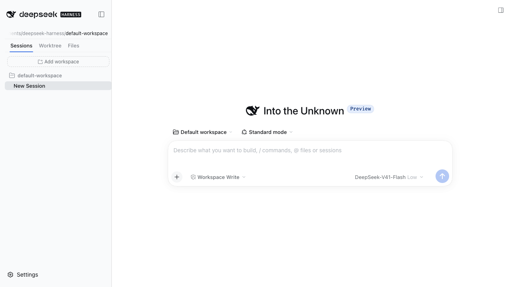
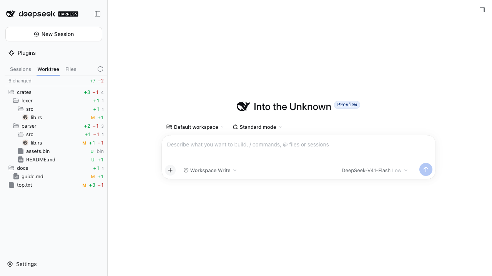
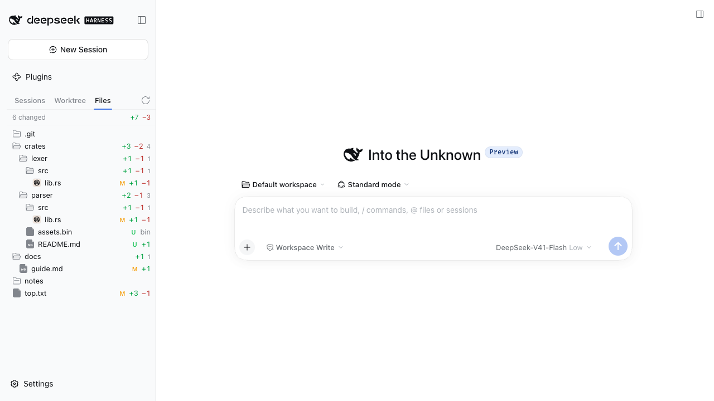

> **After any change, restart `dsh web`.** The bundle has two halves: the browser
> half reloads with the page, but the **Host** half — every route, and everything
> that runs `git` — is loaded once at boot. A Host change that has not been picked up
> looks exactly like a bug, and has twice: a diff route that answered "not found",
> and a path looked up twice over so every change read as "no difference".
>
> Restarting is always safe and always correct, so when something behaves like an
> older version of itself, restart before reporting it.

# dsh-plugin-git-tree

A three-tab git panel that takes over the **Workspaces region of the left
sidebar** in the DeepSeek Harness web GUI.

| Sessions | Worktree | Files |
|---|---|---|
|  |  |  |

- **Sessions** — the Workspace → Session outline, plus the operations the region
  is responsible for:
  - **New Session** is the small **+** on a Workspace header, which starts a
    Session in that Workspace (`uiWorkspace.startSession`). There is no tab-level
    New Session button: every Workspace already carries one.
  - **Rename** is the pencil on a row, or a double-click on its title. The title
    is written into the Session's own log through the Session object layer —
    `sessions.using(id, { source: 'gitTreePanelOperation' }, reference =>
    reference.binding.session.rename(title))` — the same path the shell's rename
    dialog takes, and the panel declares its own reference source rather than
    borrowing the Workspace browser's.
  - **Add workspace** is the only tab-level action. The region this panel shadows
    owned that action too, so it has to own it: with the last Workspace deleted
    there is otherwise nothing to start a Session in. It opens the directory
    picker and registers the choice (`workspaces.create({ path })`).
  - **Delete empty workspace** is the bin on a Workspace header, offered only once
    nothing is left in it. This is `workspaces.delete` — the Host's own command,
    documented as *"Delete a Workspace registration without deleting Sessions or
    files"* — so it removes the stale registry entry that a deleted session log
    leaves behind, which is otherwise only reachable by stopping `dsh web` and
    editing `storages/workspace.json`. It is deliberately not offered for a
    populated Workspace: what the Host does with those Sessions is not this panel's
    call to make. Empty a Workspace first, then delete it.
  - **Row actions take no space until they are shown, and the title yields when
    they are.** The buttons are laid over the row's trailing edge rather than into
    it, so an idle outline spends none of its width on them, and `:focus-within`
    reveals them so a keyboard reader still reaches them. While they are shown the
    title reserves that same width, which is what keeps the icons off the text.

    Covering the text instead does not work here: the row's hover fill is a **10%
    tint** (`rgba(38, 49, 72, 0.1)`, measured), so a cover inheriting it would show
    the title straight through. Reserving is the honest fix — the title truncates
    earlier for as long as the buttons are up, rather than hiding its own tail.

  - **Arranging** is drag and drop, at both levels: a Session within its Workspace,
    and a Workspace within the outline. Both registry moves mean the same thing —
    place this before that, or at the end when there is no anchor — so a drop is
    resolved into one of those calls rather than into a position, and dropping on
    the outline's own space appends.

    A drop lands the dragged item in the target's **slot**, which means the drag's
    direction decides the anchor: moving down anchors on whatever follows the
    target. Anchoring on the target itself is right for an upward drag and is a
    no-op for a downward one — "before the row below" is where the row already is —
    which is exactly how a downward drag first appeared to do nothing at all. The
    mark sits on the edge the drop will land on for the same reason.

    Three drops are refused rather than guessed at. A Session is only ever moved
    **within its own Workspace**: the registry can carry one between Workspaces,
    but a Session's Workspace is what resolves its working directory, so that is a
    different act than arranging. A drop on the dragged item itself does nothing.
    And a kind dropped on the other kind means nothing. The dragged item is held in
    a ref rather than read back from `dataTransfer`, because `dragover` — which is
    what has to accept the drop — cannot read the payload.

  - **Each row carries one mark**, and only while it has something to say. A ring
    turns while work is in flight; an orange dot means the Session is waiting on the
    reader; a green dot means it finished with something unread. A Session that is
    merely idle shows nothing — reading it clears the mark, so the mark keeps
    meaning something. The state is also written out for a reader who cannot see a
    colour or a spin.

    Running comes from the list summary's own field, which the status store
    reconciles *from*; that store adds the two states the summary does not carry.
    A pending interaction outranks running, because a Session that asked a question
    is stopped until it is answered.

    Confirmed on a live instance. A note for anyone verifying this bundle in
    isolation, because it cost real time here: a **copied** profile's
    `agent-default-model` may name a provider the copy does not configure —
    `openai-codex`, where the configured one was `new-api` under `llm-pi-ai` — and
    every turn meant to be running will already have failed with `Provider is not
    configured`. The rows are then right to say nothing, and it reads exactly like a
    broken mark. Point the isolated profile at a configured provider and put its key
    in the process environment before concluding anything about this row.

  - **A rolling output-token rate** sits in the status bar, beside the change counts.

    DSH's own `tok/s` is `decodeTokens / decodeMs` from a whole-log projection: the
    Session's lifetime decode average, which converges and then stops moving. Its
    window cannot be made honest either, because the durable log carries one
    `assistant/message` per **step** — the tokens are not in the log at all.

    So the rate is measured here, from the one thing that does move: the cumulative
    output-token count, **sampled on a clock**. Two samples of a counter say nothing
    about speed; two samples and the time between them do. Sampling on a timer even
    when the count has not moved is the whole trick — the counter stops while the
    wall clock does not, so the window fills with stillness and the figure falls.
    When the last growth ages past the 15-second window it reads zero, which is what
    a Session that has stopped is doing.

    Wall-clock seconds rather than decode seconds, deliberately: decode time also
    stops growing when a Session idles, so a ratio over it would hold its last value
    forever — the very freeze this exists to avoid. Time in tools therefore counts
    against the rate, which is the honest reading of "how fast right now".

  - **DSH's own `tok/s` pill is overwritten** with that same measurement. This is a
    hack, and it is one on purpose: the honest fix is inside the pill's component,
    and none of it is reachable from a plugin.

    The figure reads a whole-log projection, so it is the Session's lifetime decode
    average. Its window cannot be finished off host-side either — the projection seam
    takes a definition and owns delivery, so a unit cannot re-publish on a clock — and
    a decaying number needs a clock, because the count stops while time does not.
    The component has no clock of its own, so even a correct value would sit frozen
    until something else made it re-render.

    So the number is written into the DOM, and kept there. React re-renders that pill
    constantly while a Session streams, which would normally undo an override; a
    `MutationObserver` re-applies it on the next frame, so a reader sees one number
    rather than a flicker between two.

    Kept worth having by one rule: a rate inside `[data-chat-flow]` is left alone. A
    turn's own usage panel is built from the same copy and reads the same
    `N tok/s`, but that figure is historical and for that turn — only the composer's
    ambient pill is the live one.

    The panel's status bar shows the same measurement and does not touch anyone's
    DOM, so it is the one to prefer if this ever misbehaves.

  - **The right Sidebar's tabs follow the Session**, which is DSH's own behaviour: the kit
    keys a panel layout by Session, so each Session keeps its own tab set. An earlier version
    shelved them per Workspace instead; that override is removed, and the plugin no longer
    opens or closes a tab on the reader's behalf.

    The subtlety that made this a bug rather than a feature: a resource address is
    **Session-scoped** — `dsh-resource://<protocol>/session/<id>/<path>` — so the
    tabs one Session had are not the tabs another Session can open. Replaying them
    verbatim opens resources belonging to the Session they came from, which is why
    every switch used to re-open the set and the tabs piled up. Entering re-points
    each address at the Session being entered; the path carries over because a
    Workspace's Sessions share a workspace root.

    Entering also **matches**, in both directions. Adding alone leaves a Session
    holding a tab the reader closed elsewhere, and that copy is handed straight back
    to the set the next time the Session is recorded — so the tab returns from the
    dead on every switch.

  - **Delete session** is the bin on a Session row. This is the Host's *archive*: the Session
    leaves every list and `uiWorkspace.unarchiveSession` restores it, which the
    shell's browser offers. It is not a deletion of the Session log, and it is
    refused while the Session still has running work — the reason is shown on the
    row.

  Selecting a row goes through the same `uiWorkspace` navigation action the
  built-in browser uses. Archived Sessions and subagent Sessions stay out of the
  outline, and a Workspace with no Sessions on disk is dropped rather than drawn
  as an empty header — which also keeps a stale registry entry invisible.

- **Status bar** — leads the panel, so it lands directly under the brand: this
  region is mounted as the sidebar's Workspaces seat, and the only rows above it
  are the brand and the global-panel list. It shows the Session workspace's
  **full path** through the shared `PathLabel`, which keeps the trailing segments
  visible and reveals the whole path on hover. The git tabs add their change
  counts on the right.
- **A picture reads as a picture.** A diff of an image is the sentence "Binary
  files differ", which says nothing the row did not already. Those paths get two
  views instead: **Diff** puts the committed version beside the working one, and
  **Whole** draws the working one at its natural size — the one place a reader wants
  the real pixels, so it is not stretched to the pane. Which paths those are is an
  extension test (minus SVG, which is a picture *and* text, so it diffs); reading
  bytes to decide would be a read per changed path on every poll.

  The bytes come from the two places that hold them. The working side is the
  workspace-files Remote, as an object URL. The committed side is git — and that
  read is awkward, for a reason worth writing down: the subprocess service hands
  over **decoded text**, so image bytes cannot survive it. `git archive
  --format=tar --output=<file>` is the command that both writes to a path of our
  choosing and reads a committed tree, so the blob is written to a tar in the OS
  temp directory and read straight back out of it. `git checkout-index --temp` also
  writes a file, but of the *index* — the wrong side of the comparison — and into
  the working directory. The route carries the bytes as base64 in the same JSON
  envelope as everything else, capped at 2 MiB, so a path HEAD does not hold answers
  `no-previous` rather than looking like a failure.

- **A change reads three ways.** The Changes tab's header carries a switcher:
  **Unified** — the diff down one column, as git wrote it; **Split** — the same diff
  across two, the removal beside its replacement; and **File** — the path handed to
  the product's own preview rather than a second code viewer written here. Unified
  and split come from the one text the Host sent: within a hunk git states every
  removal before the addition replacing it, so a run of removals pairs with the run
  of additions that follows, and runs of unequal length leave the shorter side blank
  rather than shifting the pairing. Headers cannot be split, so they span — drawn as
  two cells they would say nothing at all.

  `File` opens that preview **in this tab's place**: `replaceTab` hands over the pane
  and strip slot and closes this tab in the same step, so the switcher switches
  rather than accumulating a second tab for one file. Choosing Unified or Split
  again means opening the change once more from the Worktree list — the tab is the
  file's now. `DiffBlock` in `ui-primitives` is the
  obvious thing to reuse and is not a fit: it takes before/after fragments for tool
  edits, not a patch, and draws unified only.

- **Changes** — clicking a row in the Worktree tab opens that path's **unified
  diff** in the right Sidebar, in a tab type this bundle registers. The tab is a
  resource holder: it reads through the `gitdiff` protocol this plugin provides, so
  it follows the working tree on the same one-second beat as the panel and a read
  that found nothing new publishes no frame. `git diff HEAD` answers for both
  halves of a change at once — staged and unstaged appear together and in file
  order rather than as two concatenated halves — and an unborn branch falls back to
  the index and work tree read separately. An untracked path has no baseline, so it
  is read against `/dev/null` and drawn as a whole-file addition under an
  `untracked` badge; `git add --intent-to-add` would answer with one diff instead,
  but it writes to the index, and reading a repository must not change it. The
  Files tab still opens the *file*: it lists a tree, not a change set.

  The failure lives inside the resource's value rather than in the resource's own
  error branch. A resource frame's failure is a `RemoteFailure` — a union of
  `RemoteError` class instances that only a generated Remote can produce — and this
  is a plain HTTP route, so it has no such value to hand back.

- **Process rows open themselves.** Work details `verbose` un-folds a completed
  Turn and lists its process rows directly, but every row keeps its own disclosure:
  `useDisclosure` starts collapsed and takes no policy input, so no mode and no
  setting opens them. This bundle opens each as it appears — a row is a
  `<div data-expandable aria-expanded="false">`, not a native `<details>`, so it is
  opened by clicking it, which is what React listens for, and the rows are scoped to
  the transcript's own `[data-chat-flow]` column.

  Each row is opened **once**, keyed by the identity its ancestors carry —
  `data-chat-call-id`, else the node key and group part. A plain "open everything
  that is closed" pass would undo the reader's own collapse on the next render,
  which is the same loop the per-workspace panel memory had to avoid. Transcript
  mutations arrive constantly while streaming, so passes are coalesced.

- **Older history loads on scroll.** The transcript pages older history from a
  "Load earlier" control and from nothing else — nothing in the chat is
  scroll-driven, there is no setting for it, and no service reaches the view's
  scroll controller. This bundle presses that control when the reader comes within
  320px of the head. One capturing listener on the document rather than per-port
  bookkeeping, because `scroll` does not bubble and the port can be replaced
  without notice; the control is found by its CSS-module local name, as the shell's
  New Session button is hidden; and a press is skipped while the control is
  disabled, which is exactly the window the chat keeps a page in flight for.

  A page is `maxMessages: 500` with `turnWindow: { minMessages: 50, minTurns: 2 }`,
  so the control only appears in a long Session — which is also the only place this
  has anything to do. It is a chat concern rather than a git one, and it lives in
  this bundle because this bundle is what this profile ships.

- **Panels are per Workspace, not per Session.** The kit keys a right-panel layout
  by Session, so two Sessions of one Workspace hold unrelated tab sets and moving
  between them shelves and restores nothing. This bundle makes the Workspace the
  owner: entering a Session opens whatever its Workspace had, and the foreground
  Session's tabs then become that Workspace's set. The memory is in-memory only and
  lives as long as the plugin.

  The seam is the controller's open-tab inventory — a read-only observable it
  already shares with content providers, and the reason none of this has to close a
  tab to learn what is open. `ISidebarRight` is operations-only and declares no
  inventory, so the field is named through a documented cast rather than reached
  through the declared type; nothing writes a layout through it. Restoring opens
  addresses (`openResource`), because a page opened by kind would need that kind's
  own navigation parameters, which a tab record does not carry — such a tab is
  dropped rather than reopened wrong.

  A Session belongs to exactly one Workspace, so a Session's tabs can never mix two
  Workspaces, and entering only ever needs to add.

  Two rules keep that from becoming a loop, and both were learned from one bug:
  closing the last tab collapses the column, which unmounts the seat.

  - **A missing seat is not a departure.** The tracked Session is kept, so coming
    back to it is never an arrival. Clearing it there made the next mount read as an
    arrival and reopen the tab the reader had just closed.
  - **The set is recorded whether or not a seat is mounted.** Otherwise the one
    moment that matters most — the reader emptying the panel — is the one moment
    nothing gets recorded, and there is something left to restore.

  The remaining subtlety is the tick after arriving: a Session is empty at the
  instant it becomes foreground, and recording it then would erase the memory, so
  that tick is skipped and the opens it issued are what get recorded.

- **Close all tabs** is an entry this bundle adds to every right-Sidebar tab's own
  menu, beside the kit's *Close*. The controller publishes operations and no
  inventory — nothing lists the open tabs, and no published service carries the
  per-session layout store behind them — so the only way to close them all is the
  way a person does it: close the tab in front of you and let the kit focus a
  survivor (`active()`, then `close(id)`). Three things follow from that, and all
  three are handled: a close may not have settled when the call returns (a kind may
  retain asynchronous cleanup first), so each step waits out a settle window; a tab
  that refuses to go — the kit's guide, which draws no close control and records
  nothing on a programmatic close — leaves itself active and ends the walk instead
  of spinning; and the walk is capped so a kind that fails its own close handler
  cannot hold it open. Closing the last tab collapses the column, which is the
  kit's own rule for a tab standing alone.

- **A submodule is a folder, marked as one.** The superproject records a gitlink —
  a commit of another repository — so the path is a directory, not a file with
  contents. Git is asked for the modes (`git diff --raw`, whose `160000` is a
  gitlink) rather than the index, because `git ls-files --stage` would list every
  tracked file in the repository once a second. Git counts a gitlink as one changed
  line, which describes the recorded commit and nothing a reader can act on, so a
  submodule reports no counts and the row carries a `submodule` mark instead.

  Opening it lists **what is in it**, through the same view the Files tab uses —
  started inside the submodule, while the paths it opens stay workspace-relative.
  The first cut showed the submodule's own *changes* instead, which reads as an
  empty folder whenever its checkout is clean — and a clean checkout is the usual
  state of a submodule whose pointer moved, which is exactly when a reader opens
  one. It starts closed and lists on first open; closing it drops the listing. A
  submodule's own changes are not folded into the enclosing totals — they are
  another repository's — and the gitlink's own status stays live from the
  enclosing repository's poll.

  A file inside one diffs against the repository that holds it, not the Session's.
  Those differ for a submodule, and the workspace's repository sees only a gitlink —
  it would call the file untracked. So the diff route asks the file's **own
  directory**, where git walks up to the innermost repository, falling back to the
  workspace root for a path whose directory is gone (a file deleted along with its
  directory). The commands that use the resulting path then run from the
  **repository root**, because the path is repository-relative: run from the
  workspace instead, a nested path is looked up twice over and the file reports no
  change at all. That probe uses `git -C` from the workspace rather than running *in*
  the directory: a process spawned with a cwd that no longer exists fails at the
  process level, where no caller can catch it, whereas git reports a missing `-C`
  directory as an ordinary non-zero exit. The diff still reports the
  workspace-relative path, because that is the path the reader asked about.

- **Worktree** — the uncommitted changes, **grouped by folder**. Every folder row
  carries the counts aggregated over everything beneath it, so a collapsed folder
  still says how much moved inside; a binary leaf says `bin` instead of inventing
  counts.
- **Files** — the whole Session workspace as a folder tree, one level at a time,
  with the same change counts written onto the rows they belong to. It lists
  lazily, so it would open fully collapsed and show nothing about the changes the
  other two tabs are about; opening it seeds the expansion with the folders a
  change lives under (bounded at 60 folders, once per Session and re-seed), so the
  changed paths are open and everything else stays shut. A folder you then
  collapse stays collapsed.

A file row in either git tab opens through the same `dsh-resource://file/…`
address the built-in browser uses, so it lands in a right Sidebar preview —
including when the click came from inside the left sidebar.

> **Read this before enabling it.** The panel *shadows* the shell's
> Workspaces/session browser, which is the same region. That is why the Sessions
> tab exists: it is a deliberate reimplementation of that browser's outline, not
> a replacement for it. The built-in browser returns the moment the plugin is
> disabled, unloaded, or removed. What the Sessions tab does **not** carry over
> is the browser's search, workspace rename/delete menus, and archive actions.

## The shell's New Session button is hidden on purpose

`ui-sidebar` declares no slot for that button, so no registration can remove it.
The panel's stylesheet carries one rule that reaches outside the panel instead:

```css
[data-slot='sidebar'] [class*='_newSession'] { display: none; }
```

Starting a Session is the small **+** on each Workspace header, and the collapsed
rail carries its own New Session icon, so the shell's control is redundant in both
states — and hiding it costs nothing, because the rail keeps the action. The rule
matches on the CSS-module local name rather than the button's `aria-label`, which
is copy and therefore changes with the language, and it is scoped under the
layout's own `data-slot="sidebar"` seat. A rename upstream stops the rule
matching, which brings the button back rather than breaking anything.

## The Plugins row is hidden on purpose

The bundle's patch layer carries a second entry:

```yaml
- id: ui-plugin-manager
  disabled: true
```

`ui-plugin-manager` registers a `sidebar.panellist` row plus the `main` panel it
opens, and it is the **only interactive** plugin surface — Settings → Plugins
carries just the read-only inventory (`ui-settings-plugin-inventory`), which is
what remains after this. So installing, enabling or removing a bundle is a profile
edit rather than a click.

This is a deliberate product choice for this profile, not a side effect of the git
panel. To bring the page back while keeping the panel, override it in the
profile's own `cordis.patch.yml`, which is applied after every bundle layer:

```yaml
- id: ui-plugin-manager
  disabled: false
```

Disabling or removing this bundle also restores it, since the entry lives in its
layer.

## What it is made of

One package, two faces, the ordinary DSH plugin shape:

| Face | Artifact | Responsibility |
|---|---|---|
| Host | `lib/index.js` | One authenticated JSON route, `GET /api/git-tree`, that runs `git` in the Session's workspace and answers the change set. |
| Browser | `lib/client.js` | Registers the dictionaries and the `sidebar.workspaces` region. |

The browser half reads the directory listing from the **existing**
`workspaceFiles` Remote namespace (`@deepseek-ai/dsh-api-workspace-files`), so no
file-listing code is duplicated; only git needs a new Host endpoint.

### Why `priority: -1`

The shell declares the `sidebar.workspaces` slot and `ui-workspace` fills it at
the default priority. A `single` slot renders its **lowest** live priority, so
this plugin registers at `-1`:

```ts
ctx.slots.register({ name: 'sidebar.workspaces', priority: -1, locale: NS, inject: face }, GitSidebar)
```

That *shadows* the workspace browser rather than replacing it. The distinction
matters: a shadowed entry stays registered, so the child slots it declares
(`sidebar.workspaces.directoryFlow`, `sidebar.workspaces.session.menu.item`, …)
remain declared for the plugins that contribute to them, and the browser resumes
untouched when this plugin unloads. This panel declares no children of its own,
so it cannot collide with those declarations.

### Where the Session identity comes from

`sidebar.workspaces` is **root-scoped**, so no `sessionId` arrives in the props —
but the Remote namespace and the `/api/git-tree` route both need one, because the
Host resolves the workspace root from it. The panel derives the foreground
Session the same way `ui-workspace` does: the row the main view retains
(`retainedBy.mainView > 0`). Two primitive `useSessions` selections carry the id
and the `cwd`, so neither subscription churns on a new object.

### The two services it borrows

Taking over the region means borrowing the two actions the region used to own,
and both are injected **optionally** so the panel still renders without them:

| Service | Used for | Without it |
|---|---|---|
| `sidebarRight` | `openResource(address)` — opening a file row in a preview | file rows do nothing |
| `uiWorkspace` | `openSession(sessionId)` — selecting a Session row | session rows do nothing |

### The Host route

`GET /api/git-tree?sessionId=<id>` on the shared API channel, registered through
`ctx.connection.fetch.register` rather than a bare `ctx.webServer` route. That
matters: `/api` is a **prefix** route owned by `@deepseek-ai/dsh-client-connection`,
and because the webserver matches an exact route before a prefix, a hand-rolled
`ctx.webServer.register({ kind: 'exact', path: '/api/git-tree' })` would win over
that prefix and silently bypass the Host/Origin fence and browser authentication.
Registering on the connection's Fetch table runs *inside* the fence.

The route takes the Session id and resolves the workspace root from the live
Session header — the browser never names a path, so it can only ask about a
Session it can already see. The response is one of:

```ts
| { status: 'ok', snapshot: GitSnapshot }
| { status: 'no-repository' }
| { status: 'error', code: string, message: string }
```

`GitSnapshot` carries `repositoryRoot`, `workspaceRoot`, a `changes` array of
`{ path, kind, insertions, deletions, binary }` with `path` relative to the
workspace root, and `totals`.

### How the counts are read

Four git commands, all scoped to the workspace with a `.` pathspec and run with a
scrubbed environment (`GIT_CONFIG_COUNT=0`, `GIT_TERMINAL_PROMPT=0`,
`GIT_OPTIONAL_LOCKS=0`), a timeout, and bounded output:

| Command | What it answers |
|---|---|
| `rev-parse --show-toplevel` | the repository, or "not a repository" |
| `rev-parse --show-prefix` | git's own translation of the workspace into the repository's spelling |
| `status --porcelain=v1 -z -uall` | which paths changed, and how |
| `diff --numstat -z -M HEAD` | line counts per path (renames detected) |

`--show-prefix` is doing real work. Deriving the workspace-relative path with
`path.relative(workspaceRoot, join(repoRoot, gitPath))` breaks wherever the
Session's path is not the canonical one — on macOS a workspace under `/tmp` is
`/private/tmp` to git — and every change would then look like it fell outside the
workspace. Asking git for the prefix sidesteps the comparison entirely. There is
a regression test for exactly this.

Two cases need more than `diff HEAD`:

- **Unborn branch** (no `HEAD` yet): the index and the work tree are read
  separately (`diff --cached` and `diff`) and merged per path.
- **Untracked files**: `git diff` does not see them, so their added-line count is
  read from the file itself, under a size cap, with a NUL-byte binary sniff.

## Build

Sources are TypeScript (`src/`); the two artifacts are transpiled by
`scripts/build.mjs`:

```sh
pnpm install
pnpm run build        # → lib/index.js, lib/client.js, lib/types/**
pnpm run typecheck    # tsc --noEmit against the real DSH type packages
pnpm test             # builds, then 37 tests
pnpm run check        # typecheck + test
```

`build.mjs` uses `esbuild` for both faces and then runs a **module-graph gate**,
mirroring the one the DSH client-bundle preset enforces: it re-reads
`lib/client.js`, collects every `require()` specifier, and refuses any that is
neither one of the shell's nine seeded platform modules nor declared in
`dsh.client.external`. A `require()` the module table cannot answer is a
guaranteed runtime throw, so the build fails instead. The current bundle requires
only `react`, `react/jsx-runtime`, and `@deepseek-ai/dsh-client-ui-primitives`.
`@deepseek-ai/dsh-util-workspace-path` is inlined, which is what the product's own
build does with it.

The Host bundle imports nothing but `node:fs/promises` and `node:path`, so the
plugin never ships its own copy of a DSH package and cannot shadow the running
installation.

## Install into a profile

The package declares `dsh.bundle.patch`, so it is a profile **bundle**: its layer
inserts one Host row, and the same row's `dsh.client` declaration makes the shell
serve its browser bundle.

```sh
# 1. Build it.
cd /Users/jakku/Dev/SakuraLens/deepseek-harness-plugin
pnpm install && pnpm run build
```

```sh
# 2. Put it into the profile. `--profile <name>` is required by every
#    `dsh plugin` invocation; `add` forwards to pnpm with the profile directory
#    as its cwd, and the bundle is selected automatically because the package
#    declares `dsh.bundle`.
dsh plugin --profile web add /Users/jakku/Dev/SakuraLens/deepseek-harness-plugin
```

Equivalent by hand, which is what this checkout did: in
`$DSH_HOME/profiles/web/package.json`, add

```json
"dependencies": {
  "dsh-plugin-git-tree": "link:/Users/jakku/Dev/SakuraLens/deepseek-harness-plugin"
}
```

and append `"dsh-plugin-git-tree"` to `dsh.profile.bundles`, then run
`pnpm install` **in the profile directory**. `link:` (rather than `file:`) keeps
the profile pointing at this checkout, so `pnpm run build` is enough to pick up a
change — the module registry derives each bundle's revision from its artifact's
`mtimeMs`/`ctimeMs`/size, so a rebuild is noticed without touching the profile.

> **A new bundle layer needs a fresh `dsh web` process.** The running one keeps
> the composition it started with; only `cordis.patch.yml` edits are hot-reloaded.
> Check the composition before restarting:
>
> ```sh
> dsh --profile web --dump-config | grep -A2 'dsh-plugin-git-tree'
> ```

To remove it: `dsh plugin --profile web remove dsh-plugin-git-tree` (or delete the
dependency and the bundle name, then `pnpm install` in the profile), then
restart. Disabling the bundle on the Plugins page is enough to get the session
list back without uninstalling.

## Tests

```sh
pnpm test
```

`node --test tests/*.test.mjs` — 37 tests in five files:

| File | Covers |
|---|---|
| `tests/git-parse.test.mjs` | The porcelain and numstat walkers against literal recorded bytes, including rename records and their extra NUL-separated fields. |
| `tests/changes.test.mjs` | The browser folds: path joins, the workspace-relative form, directory aggregation, entry ordering, the folder tree the Worktree tab draws, and the folder set the Files tab opens with. |
| `tests/sessions.test.mjs` | The Sessions outline: grouping under a Workspace in manual order, and the archived/subagent/unknown-row exclusions. |
| `tests/host-route.test.mjs` | The Host half end-to-end. Loads `lib/index.js`, applies it to a context whose `subprocess` is backed by real `node:child_process` spawns, and drives the registered route against throwaway repositories built per case — modified, staged rename, binary, deleted, untracked-without-trailing-newline, nested workspace, unborn branch, and no-repository. |
| `tests/client-bundle.test.mjs` | The browser artifact, executed the way the shell executes it: through `window.__ModuleLoader__.load` with a `require` that answers module-table entries. Asserts the handoff id, the plugin's `apply`/`inject`, the single `sidebar.workspaces` registration and its priority, that the tab strip reads Sessions → Worktree → Files with Sessions selected, both the wide and rail presentations, the folded outline, session navigation, and that the injected face builds a correctly encoded `dsh-resource://file/…` address. |

## Known limitations

- **A route answer that is not JSON is reported as such.** The Host half of a
  plugin mounts once at boot, so a route added since `dsh web` started answers the
  fence's plain-text `not found` while the browser half — served per load — already
  knows about it. Reading that with `response.json()` throws a syntax error naming
  the text it choked on, which is the symptom and never the cause. Both routes go
  through one reader that reports the status and the body, and calls the 404 case
  out by name with the restart it needs.
- **The Changes tab shows text diffs.** A binary change reads as git's own
  `Binary files … differ` line. The diff is capped at 512 KiB and the tail says so.
- **The Sessions tab is an outline, not the full browser.** Search, workspace
  rename, pinning and forking are not reproduced. Session rename/delete, workspace
  add/delete, New Session, and drag-ordering at both levels are. Disable the bundle
  to get the rest back.
- **Arranging is pointer-only.** The drop targets are the rows themselves, so
  reordering a Session or a Workspace needs a drag; there is no keyboard path to
  it yet, which is the one part of this panel a reader without a pointer cannot do.
- **Delete archives.** DSH has no session hard-delete. Removing the log would also
  fight the Host, which holds sessions in memory — the same reason a workspace
  registry edit does not stick while `dsh web` runs.
- **Uncommitted changes only.** The panel reports the working tree against
  `HEAD`; it has no commit log, no branch, and no ahead/behind counts. A
  `git commit` tab is deliberately not implemented yet.
- **Workspace-scoped.** A repository above the Session's working directory is
  reported, but only the workspace's own subtree appears.
- **Line counts for text.** Binary files are marked `bin` with no counts, and an
  untracked file larger than 512 KiB is listed without counts.
- **Caps.** One response carries at most 2000 changes and 4 MiB of git output;
  past that the response sets `truncated` and the totals still report the whole
  set.
- **Polls, rather than watching.** The git tabs re-read the working tree on a
  one-second timer, so they follow an edit, a branch switch or a `git add` without
  anyone pressing anything. It is a timer and not a filesystem watch: a read is
  issued rather than an event received, so the interval is a floor — a tick is
  skipped while the previous read is still out, which keeps a slow repository from
  stacking work. Nothing polls while the sidebar is collapsed, while the document
  is hidden, or on the Sessions tab, which the store signals already drive. The
  Files tab re-lists its open directories on the same tick; the Worktree tab only
  re-reads the change set.

  A poll is meant to be invisible, and two things had to be true for it to be:

  - **A refresh does not blank what it refreshes.** Only a directory with nothing
    to show yet reports `loading`; a re-read keeps the listing it already has on
    screen until the new one arrives, so a tick never flashes a placeholder over a
    tree that is already up.
  - **An unchanged listing keeps the object it had.** Each read arrives as new
    arrays of new objects, so `sameLevel` compares one against the other and the
    state update is skipped when nothing moved — otherwise the tree would
    re-render once a second on a directory that never changed.

  The change-folder seeding is keyed on the Session and workspace, *not* on the
  poll's revision: a tick must not re-open a folder the reader just collapsed.
